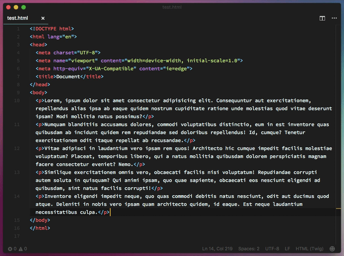
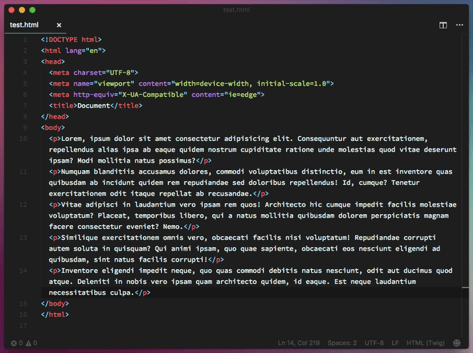

# VS Code Rebound Delete

One of my favorite features of Sublime is using `CMD+Backspace` to delete the contents of a line and—if you are at the start of the line—it deletes it and moves up to the next one. I had a difficult time moving to VS Code because this was missing. I created a small plugin to allow for this functionality.

## Before

## After

## Icon Credits
Created by Makarenko Andrey from the Noun Project
